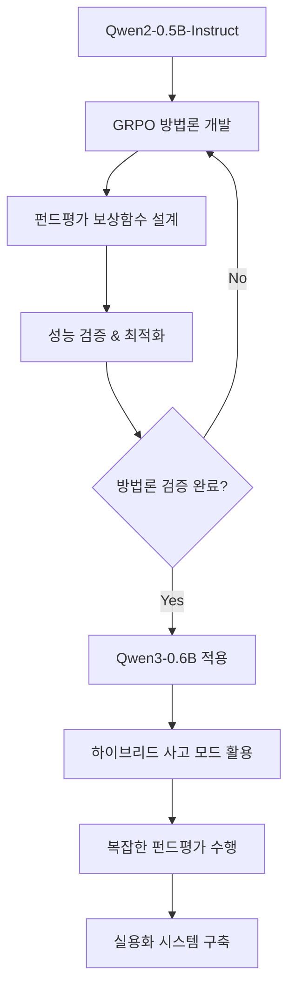

# LEARN-GRPO

작성일: 25.06.30
버전: 0.1.0

## 프로젝트 개요
**GRPO(Group Relative Policy Optimization) 알고리즘을 활용하여 펀드평가 회사의 내부 펀드평가방법론을 학습한 AI 평가 전문 모델** 개발 프로젝트입니다.

> **주요 발전사항**: DeepSeek R1 (2025년 1월 22일 발표)이 GRPO를 핵심 훈련 방법론으로 사용하여 OpenAI o1-1217과 비교할 만한 추론 성능을 달성했습니다. 이는 GRPO의 실용적 가치를 입증하는 획기적인 성과입니다.

## 비즈니스 목표
- **펀드평가 업무 자동화**: 기존 수동 평가 프로세스의 효율성 향상
- **평가 일관성 확보**: 평가자별 주관적 편차 최소화
- **평가 품질 향상**: 내부 전문 지식을 AI로 체계화하여 평가 정확도 개선

## 연구 목표
- **GRPO 알고리즘**을 펀드평가 도메인에 특화하여 적용
- 내부 펀드평가방법론을 강화학습 환경으로 모델링
- **TRL GRPOTrainer** 기반 펀드/펀드운용사 평가 AI 에이전트 개발
- 실제 펀드 데이터를 활용한 GRPO 평가 전략 학습 및 검증
- **DeepSeek R1 방법론**을 참고한 펀드평가 특화 GRPO 구현
- 펀드평가 전문 지식과 GRPO 알고리즘의 융합 방법론 확립

## 연구 계획

### 1단계: GRPO 알고리즘 기초 연구 및 이해
**DeepSeekMath와 DeepSeek R1의 성공 사례를 바탕으로 GRPO 알고리즘의 핵심 원리를 이해합니다.**

- **DeepSeekMath GRPO 논문** 및 관련 자료 심층 분석
- **DeepSeek R1 논문 분석** (2025년 1월 최신 성과)
- GRPO vs PPO/A3C/SAC 비교 연구로 알고리즘 장단점 파악
- **Group Relative Policy Optimization** 개념 및 장점 분석
- **TRL GRPOTrainer** 공식 문서 및 API 학습
- GRPO 수학적 원리 및 알고리즘 구조 이해
- 기존 구현체 분석 (TRL, GitHub, 논문 코드)

### 2단계: GRPO 기본 예제 구현 및 검증
**Qwen2-0.5B-Instruct 모델을 사용해 TRL GRPOTrainer의 기본 동작을 검증하고 펀드평가 적용 가능성을 확인합니다.**

- **TRL v0.19.0 GRPOTrainer** 환경 구축 및 테스트
- **DeepSeek R1 스타일** 간단한 추론 태스크에서 GRPOTrainer 검증
- 기본 GRPO 파이프라인 구축 (데이터 로딩 → 훈련 → 평가)
- **PPOTrainer vs GRPOTrainer** 성능 비교 실험
- GRPO 하이퍼파라미터 민감도 분석 (`num_generations`, `reward_weights` 등)
- 학습 안정성 및 수렴성 검증
- **보상 함수 설계** 실험 (DeepSeek R1 참고)
- 코드 리팩토링 및 모듈화

### 3단계: GRPO 샘플 모델 개발 및 실험
**다양한 NLP 태스크에서 GRPO의 실용성을 검증하고 펀드평가 적용을 위한 기술적 기반을 마련합니다.**

- 복잡한 NLP 태스크(감정분석, 텍스트 분류)에서 GRPO 성능 테스트
- 멀티태스크 학습 환경에서 GRPOTrainer 적용 실험
- Group Relative Policy Optimization 방식의 보상 함수 설계 실험
- 다양한 보상 구조에서의 GRPO 성능 평가 및 비교
- GRPO 기반 파인튜닝 실험으로 도메인 적응 능력 검증
- 실험 결과 정리 및 펀드평가 적용 가능성 분석

### 4단계: 펀드평가 도메인 적용 타당성 검토
**내부 펀드평가방법론을 분석하고 GRPO 적용 가능성을 체계적으로 검토합니다.**

- 펀드평가 문제를 강화학습 관점에서 재정의 및 환경 설계
- GRPO의 펀드평가 도메인 적용 가능성 및 장점 분석
- 펀드평가방법론 PDF 문서 분석 및 구조화된 지식 추출
- 평가 기준의 보상 함수 변환 가능성 검토 및 설계
- 펀드 데이터 특성과 GRPO 호환성 분석
- POC(Proof of Concept) 설계 및 예비 실험 계획 수립

### 5단계: 펀드평가 특화 GRPO 프로토타입 개발
**검증된 GRPO 방법론을 바탕으로 펀드평가 전용 AI 시스템을 구축합니다.**

- 펀드평가 시뮬레이션 환경 구축 및 강화학습 환경 모델링
- PDF 기반 평가방법론을 JSON으로 구조화 및 지식 베이스 구축
- 펀드 데이터 수집 및 전처리 파이프라인 구축
- **Qwen2-0.5B-Instruct** 기반 펀드평가 특화 GRPO 아키텍처 설계
- 평가 점수 예측 모델 구현 및 최적화
- 초기 프로토타입 성능 테스트 및 검증

### 6단계: 모델 검증 및 성능 개선
**실제 펀드 데이터를 활용해 모델의 실용성과 신뢰성을 검증합니다.**

- 실제 펀드 데이터를 활용한 백테스팅 및 성능 평가
- 내부 평가 전문가와의 결과 비교 분석 및 검증
- 평가 일관성 및 정확도 검증을 통한 신뢰성 확보
- 모델 해석가능성 개선 및 투명성 강화
- 하이퍼파라미터 튜닝 및 아키텍처 최적화
- A/B 테스트를 통한 기존 평가 방식 대비 효과성 검증

### 7단계: 실용화 시스템 구축
**완성된 GRPO 모델을 실제 업무 환경에 적용할 수 있는 통합 시스템을 개발합니다.**

- 실시간 펀드 데이터 연동 및 자동 업데이트 시스템 구축
- 펀드평가 자동화 시스템 개발 및 워크플로우 최적화
- 평가 결과 대시보드 구축 및 시각화 도구 제공
- 위탁사 제공용 API 개발 및 보안 강화
- 모델 모니터링 및 지속적 학습 파이프라인 구축
- 사용자 가이드 및 운영 문서 작성

## 기술 스택
- **언어**: Python 100%
- **GRPO 구현**: Hugging Face TRL (v0.14.0+ 지원 (v0.19.0 최신 안정 버전) 공식 지원) ✅
- **기반 모델**: Qwen2-0.5B-Instruct (TRL 공식 예제 모델), Qwen2.5-7B-Instruct, Llama 등 TRL 호환 모델
- **머신러닝**: PyTorch, Transformers, TRL
- **문서 처리**: JSON, pandas, jsonschema
- **펀드 데이터**: Bloomberg API, 금융데이터 제공업체 API
- **백테스팅**: 자체 펀드평가 검증 프레임워크
- **데이터 처리**: pandas, numpy, scikit-learn
- **시각화**: matplotlib, plotly, seaborn
- **웹 인터페이스**: FastAPI, Streamlit
- **데이터베이스**: PostgreSQL, MongoDB

## 연구환경

### GPU 서버 (가비아 임대)
- **임대 기간**: ~2025년 10월까지
- **접속 정보**: 
  - IP: `211.233.58.151`
  - SSH PORT: `6622`
  - 인증: `root / 2025gabia****`

### 시스템 사양
| 구분 | 사양 |
|------|------|
| **호스트명** | userver58-151 |
| **운영체제** | Ubuntu 22.04.5 LTS (Jammy Jellyfish) |
| **CPU** | Intel Xeon Silver 4210R @ 2.40GHz |
| **코어/스레드** | 10코어 / 20스레드 |
| **최대 클럭** | 3.2 GHz |
| **메모리** | 62GB (사용 가능: 55GB) |
| **시스템 디스크** | 423GB (루트 파티션) |
| **데이터 디스크** | 3.6TB (`/data` 마운트) |

### GPU 환경
| 구분 | 사양 |
|------|------|
| **GPU 모델** | NVIDIA RTX A6000 |
| **VRAM** | 49,140MB (약 48GB) |
| **드라이버 버전** | 570.133.07 |
| **CUDA 컴파일러** | nvcc 12.6.85 |
| **CUDA 런타임** | 12.8 |
| **GCC** | 11.4.0 |

### 개발환경 최적화
- ✅ **RTX A6000 48GB**: 10B 이하 모델 최적 훈련 환경
  - **Qwen2-0.5B-Instruct** Full Fine-tuning 가능 (LoRA 불필요)
  - **TRL 공식 예제 모델** 활용한 검증된 GRPO 훈련 환경
  - 큰 배치 사이즈로 안정적 학습
  - 빠른 실험 iteration 지원
- ✅ **3.6TB 저장공간**: 대용량 펀드 데이터 및 모델 저장
- ✅ **CUDA 12.8**: 최신 PyTorch, TRL 완전 호환
- ✅ **62GB RAM**: 멀티프로세싱 데이터 전처리 지원
- ✅ **20스레드**: 멀티프로세싱 데이터 처리 및 모델 추론 지원

## 모델 선택 기준

### 🎯 **Phase 1: Qwen2-0.5B-Instruct 채택**

#### **선택 이유**
- ✅ **TRL 공식 예제 모델**: GRPOTrainer 공식 문서에서 사용되는 검증된 모델
- ✅ **작은 모델 크기**: 0.5B 파라미터로 빠른 실험 및 방법론 검증 최적화
- ✅ **Instruct 능력 완비**: SFT 완료로 즉시 GRPO 훈련 시작 가능
- ✅ **TRL 완벽 호환**: GRPOTrainer와 최적화된 통합 및 안정성 보장
- ✅ **빠른 실험 사이클**: 작은 모델로 다양한 GRPO 설정 빠른 테스트 가능
- ✅ **메모리 효율성**: RTX A6000에서 여유로운 메모리로 큰 배치 사이즈 활용

### 🚀 **Phase 2: Qwen3-0.6B 채택**

#### **🇰🇷 핵심 선택 이유: 완벽한 한국어 지원**
- ✅ **한국어 완벽 지원**: 119개 언어 지원으로 자연스러운 한국어 펀드평가 가능
- ✅ **한국어 펀드평가방법론 처리**: 한국어 PDF 문서 완벽 이해 및 분석
- ✅ **한국어 평가 결과 생성**: 자연스러운 한국어로 펀드평가 리포트 작성
- ✅ **하이브리드 사고 모드**: thinking/non-thinking 모드로 복잡한 한국어 추론 가능
- ✅ **작은 모델 크기**: 0.6B 파라미터로 빠른 한국어 실험 환경

#### **🇰🇷 한국어 지원 중심 모델 비교**
| 구분 | Qwen2-0.5B-Instruct | Qwen3-0.6B |
|------|---------------------|------------|
| **한국어 지원 수준** | 🔶 기본적 (29개 언어) | ✅ 완벽 (119개 언어) |
| **한국어 펀드평가방법론 처리** | 🔶 제한적 | ✅ 완벽한 이해 |
| **한국어 평가 결과 생성** | 🔶 어색함 | ✅ 자연스러운 한국어 |
| **파라미터 수** | 0.5B | 0.6B |
| **TRL 공식 예제** | ✅ 공식 지원 | 🔶 호환 가능 |
| **하이브리드 사고 모드** | ❌ 미지원 | ✅ 한국어 thinking 모드 |
| **훈련 속도** | ✅ 매우 빠름 | ✅ 매우 빠름 |
| **펀드평가 특화** | 🔶 제한적 | ✅ 높음 |

#### **단계별 모델 활용 전략**
```python
# 📚 Phase 1: 연구/검증 (1-4단계) - Qwen2-0.5B 기반
model_name = "Qwen/Qwen2-0.5B-Instruct"  # ✅ TRL 공식 예제 모델
# → GRPO 방법론 확립, 보상함수 설계, 펀드평가 파이프라인 구축

# 🚀 Phase 2: 적용/확장 (5-7단계) - Qwen3 모델 적용
model_name = "Qwen/Qwen3-0.6B"  # 🔄 검증된 방법론을 Qwen3으로 적용
# → 하이브리드 사고 모드 활용, 복잡한 펀드평가 태스크 수행, 실용화 시스템 구축
```

#### **연구 로드맵: 0.5B → 0.6B Qwen3 마이그레이션**


#### **마이그레이션 전략**
1. **방법론 이식**: 검증된 GRPO 설정을 Qwen3-0.6B에 그대로 적용
2. **성능 비교**: Qwen2-0.5B vs Qwen3-0.6B 펀드평가 성능 벤치마크
3. **점진적 전환**: 핵심 기능부터 단계적으로 Qwen3 적용
4. **하이브리드 사고 모드 활용**: 복잡한 펀드분석에는 thinking 모드, 일반 대화에는 non-thinking 모드

#### **🇰🇷 한국어 Qwen3 하이브리드 사고 모드 예제**
```python
# 복잡한 한국어 펀드평가 (thinking 모드)
messages = [{"role": "user", "content": """
다음 펀드의 위험도를 분석해주세요:
- 펀드명: 삼성 글로벌 성장주 펀드
- 3년 수익률: 15.2%
- 변동성: 18.5%
- 샤프지수: 0.82
/think
"""}]
text = tokenizer.apply_chat_template(messages, enable_thinking=True)
# 출력: <think>이 펀드의 위험도를 분석하기 위해...</think> 분석 결과...

# 간단한 한국어 펀드 질문 (non-thinking 모드) 
messages = [{"role": "user", "content": "펀드 수익률이란 무엇인가요? /no_think"}]
text = tokenizer.apply_chat_template(messages, enable_thinking=False)
# 출력: 펀드 수익률은 투자한 원금 대비...
```

#### **💡 왜 Qwen3인가? 한국어 지원의 결정적 차이**
| 항목 | Qwen2.5 | Qwen3 | 🇰🇷 펀드평가 영향 |
|------|---------|-------|----------------|
| **언어 지원** | 29개 언어 | **119개 언어** | ✅ 완벽한 한국어 이해 |
| **한국어 품질** | 기본적 수준 | **네이티브 수준** | ✅ 자연스러운 평가 리포트 |
| **전문 용어** | 제한적 이해 | **완벽한 이해** | ✅ 펀드 전문 용어 정확성 |
| **문서 처리** | 어색한 번역 | **원어민 수준** | ✅ PDF 문서 완벽 분석 |
| **사고 모드** | 영어 중심 | **한국어 네이티브** | ✅ 한국어로 단계별 추론 |

**🎯 결론**: 한국어 펀드평가방법론을 완벽하게 이해하고 자연스러운 한국어로 평가 결과를 생성하려면 **Qwen3가 필수**!

### 💡 **펀드평가 도메인 최적화**
```python
# Qwen2.5 기반 GRPO 구성
training_args = GRPOConfig(
    output_dir="Fund-Evaluation-GRPO",
    model_name="Qwen/Qwen2.5-7B-Instruct",
    num_generations=8,
    max_prompt_length=1024,  # 복잡한 펀드평가 프롬프트
    max_completion_length=512,  # 상세한 평가 결과
)

# 펀드평가 특화 보상 함수
reward_functions = [
    json_format_reward,      # JSON 형식 준수 (0-10점)
    evaluation_accuracy,     # 평가 정확도 (0-50점) 
    reasoning_quality,       # 추론 품질 (0-30점)
    consistency_check       # 일관성 검증 (0-10점)
]
```

## 핵심 구현 요소

### 1. JSON 기반 문서 학습 방법론
- 펀드평가방법론 문서의 JSON 스키마 설계
- JSON 구조화된 평가 기준 및 가중치 정의
- 문서 기반 지식 추출 및 특성 생성 파이프라인

### 2. TRL 기반 GRPO 구현
- Hugging Face TRL GRPOTrainer 활용
- 사전 훈련된 Transformer 모델과 GRPO 결합
- 커스텀 보상 함수 및 데이터 로더 구현
- 효율적인 분산 훈련 지원

### 3. GRPO 알고리즘 펀드평가 특화
- 일반화된 보상 함수 설계 (JSON 기반 평가방법론 지표 통합)
- 펀드평가 특성을 고려한 정책 최적화
- 다차원 평가 기준을 위한 GRPO 확장

### 4. 내부 펀드평가방법론 기반 특성
- 정량적 지표: 수익률, 위험조정수익률, 추적오차, 정보비율
- 정성적 지표: 운용철학, 조직안정성, 리스크관리체계
- 운용사 평가: 운용능력, 조직체계, 시스템 인프라
- ESG 및 지속가능성 평가 요소

### 5. GRPO 기반 펀드평가 환경
- 동적 펀드평가 환경 (시장 변화 반영)
- 평가 일관성 제약조건 모델링
- 위탁사별 평가 기준 차별화
- GRPO 특화 평가 상태-행동 공간 설계

### 6. 평가 품질 관리
- 평가 일관성 모니터링
- 전문가 피드백 학습 시스템
- 평가 결과 신뢰도 측정
- GRPO 정책 제약 조건 통합

## 예상 성과물
1. **TRL GRPOTrainer 기반 펀드평가 전문 AI 모델** (DeepSeek R1 방법론 적용)
2. **내부 평가방법론 학습 강화학습 프레임워크**
3. **GRPO 기본 예제 및 튜토리얼 코드**
4. **펀드/운용사 자동 평가 시스템** (추론 기반 평가)
5. **GRPO vs PPO/기존 평가방식 비교 분석 보고서**
6. **위탁사 제공용 펀드평가 대시보드** (실시간 추론 결과)
7. **펀드평가 특화 GRPO 구현 방법론** (DeepSeek R1 스타일)
8. **Hugging Face 모델 허브 배포용 모델** (오픈소스 기여)
9. **GRPO 기반 펀드평가 추론 모델** (복잡한 평가 로직 학습)

## 실행 방법
```bash
# TRL 및 의존성 설치
pip install trl transformers datasets
pip install -r requirements.txt

# 1단계: GRPO 알고리즘 기초 연구 및 이해
python step1_grpo_research_analysis.md

# 2단계: GRPO 기본 예제 구현 및 검증
python step2_grpo_basic_example.py

# 2단계: DeepSeek R1 스타일 GRPO 예제
python step2_grpo_reasoning_example.py

# 3단계: GRPO vs PPO 성능 비교
python step3_grpo_vs_ppo_comparison.py

# 4단계: 펀드평가방법론 JSON 스키마 생성
python step4_create_evaluation_schema.py

# 4단계: 펀드 데이터 수집 및 전처리
python step4_fund_data_collection.py

# 4단계: JSON 기반 평가방법론 특성 생성
python step4_evaluation_features.py

# 5단계: TRL GRPOTrainer로 펀드평가 모델 훈련
python step5_train_grpo_evaluator.py

# 6단계: 평가 성능 검증
python step6_validate_evaluation.py

# 7단계: Streamlit 평가 대시보드 실행
streamlit run step7_fund_evaluation_dashboard.py
```

### 2단계: GRPO 기본 예제 (TRL 기반)
```python
# step2_grpo_basic_example.py
from datasets import load_dataset
from trl import GRPOConfig, GRPOTrainer

# 데이터셋 로드
dataset = load_dataset("trl-lib/tldr", split="train")

# 보상 함수 정의 (펀드평가 특화 예정)
def reward_len(completions, **kwargs):
    return [-abs(20 - len(completion)) for completion in completions]

# GRPO 훈련 설정 (Qwen3 하이브리드 사고 모드 지원)
training_args = GRPOConfig(
    output_dir="Fund-GRPO-Model",
    num_generations=8,  # 그룹 크기
    max_completion_length=256,
    # Qwen3 thinking mode 활용 옵션 설정 가능
)

# GRPOTrainer로 훈련 (Qwen2.5-7B-Instruct - 검증된 Instruct 모델)
trainer = GRPOTrainer(
    model="Qwen/Qwen2.5-7B-Instruct",  # 검증된 Instruct 능력 보유
    reward_funcs=reward_len,
    args=training_args,
    train_dataset=dataset,
)
trainer.train()
```

### 🇰🇷 **한국어 펀드평가 완벽 지원**
- **한국어 특화 훈련**: 36조 토큰의 다국어 데이터셋에서 한국어 완벽 학습
- **펀드평가방법론 이해**: 한국어 PDF 문서의 전문 용어와 문맥 정확한 파악
- **자연스러운 한국어 생성**: 펀드평가 리포트를 자연스러운 한국어로 작성
- **한국 펀드 시장 특화**: 국내 펀드 규정과 평가 기준에 맞는 분석 제공

### 🆕 **Qwen3 하이브리드 사고 모드 (한국어)**
- **한국어 Thinking Mode**: 복잡한 펀드평가 시 한국어로 `<think>...</think>` 단계별 추론
- **한국어 Non-Thinking Mode**: 한국어 대화와 간단한 펀드 질문에 빠른 응답
- **한국어 동적 모드 전환**: `/think`, `/no_think` 명령어로 한국어 모드 변경
- **119개 언어 지원**: 글로벌 펀드 데이터 처리 (Qwen2.5의 29개 → Qwen3의 119개)
- **32K 기본 컨텍스트**: 대용량 한국어 펀드평가방법론 문서 처리
- **Agent 능력**: 한국어로 외부 도구 연동하여 실시간 펀드 데이터 분석

## 참고 자료

### GRPO & TRL 관련
- [**DeepSeekMath 논문** (GRPO 알고리즘 원본)](https://arxiv.org/abs/2402.03300)
- [**DeepSeek-R1 논문** (최신 GRPO 성과)](https://arxiv.org/abs/2501.12948)
- [Hugging Face TRL 공식 문서](https://huggingface.co/docs/trl/index)
- [**TRL GRPOTrainer API 문서**](https://huggingface.co/docs/trl/main/en/grpo_trainer)
- [TRL GitHub Repository](https://github.com/huggingface/trl)
- [**GRPO 실습 튜토리얼** (Hugging Face Cookbook)](https://huggingface.co/learn/cookbook/en/fine_tuning_llm_grpo_trl)
- [**DeepSeek R1 구현 가이드** (LLM Course)](https://huggingface.co/learn/llm-course/en/chapter12/4)

### 최신 연구 동향 (2025)
- [**GRPO vs PPO 이론적 분석**](https://pub.towardsai.net/grpo-and-deepseek-r1-zero-9e81f15c6ba2)
- [**GRPO 정렬 목표 연구**](https://arxiv.org/abs/2502.18548)
- [**Open-R1 프로젝트** (DeepSeek R1 재현)](https://github.com/huggingface/open-r1)

### 펀드평가 도메인
- [내부 펀드평가방법론 문서](내부 문서)
- [펀드평가 산업 표준 및 모범사례](https://www.gips.org/)
- [금융 AI/ML 모범사례](https://www.fsb.org/work-of-the-fsb/financial-innovation-and-structural-change/artificial-intelligence-and-machine-learning/)
- [GRPO 기반 수학/추론 모델 연구](https://huggingface.co/deepseek-ai/DeepSeek-R1-Zero)

### 구현 참고
- [**TRL GRPO 예제 코드**](https://github.com/huggingface/trl/tree/main/examples)
- [**DeepSeek R1 스타일 훈련 예제**](https://huggingface.co/learn/cookbook/en/fine_tuning_llm_grpo_trl)
- [Transformers 라이브러리 문서](https://huggingface.co/docs/transformers/index)
- [PyTorch 강화학습 튜토리얼](https://pytorch.org/tutorials/intermediate/reinforcement_q_learning.html)

## 기여 방법
펀드평가 도메인 전문가 및 강화학습 연구자들의 참여를 환영합니다!

## 라이센스
MIT License